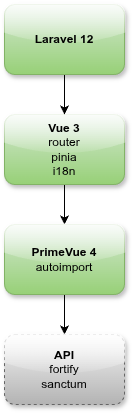

### <p align="center">Laravel 12 + Tailwind CSS 4 + Vue.js 3 + PrimeVue 4</p>

<p align="center">
&nbsp;&nbsp;&nbsp;&nbsp;
&nbsp;&nbsp;&nbsp;&nbsp;
&nbsp;&nbsp;&nbsp;&nbsp;&nbsp;

</p>

Starter kits for quick project creation.
For easy tracking of changes and updates, each starter kit is located in a separate branch.
They also contain some demo content which can be easily removed.

### 💎 Features
- Fork from the original repository. You can easily see all the applied changes.
- Minimal number of dependencies.

### 🔧 Installation

Select one of available starter kits, which located in separate branches.

```bash
# Laravel 12 + Vue.js 3 template
composer create-project rizort/laravel-starter-kits project dev-vue3

# Laravel 12 + Vue.js 3 + PrimeVue 4 template
composer create-project rizort/laravel-starter-kits project dev-vue3-primevue4

# Install dependencies
composer setup
```

### 🚀 Runing

The project will be available at http://localhost:8000.

```bash
composer dev
```

### 📁 Demo content
You can remove all demo content.
```bash
rm -rf resources/js/components/demo
```

### 🔎 Sync with Laravel repository

If you want to update the framework version used in the template, you can run these commands.

```bash
git remote add upstream https://github.com/laravel/laravel.git
git fetch upstream
git rebase upstream/12.x
```

### 🗺 Roadmap

<p>

</p>